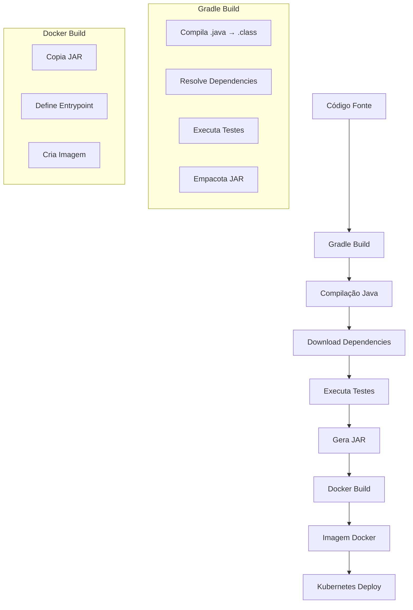

# Processo de Build da Aplicação Spring Boot

## 🔄 Fluxo Completo do Build



## 📋 Passo a Passo Detalhado

### 1. **Gradle Build** (`./gradlew build`)

```bash
# O que acontece internamente:
./gradlew build
```

**Etapas do Gradle:**
1. **Compilação**: `.java` → `.class`
2. **Download Dependencies**: Maven Central
3. **Testes**: JUnit 5
4. **Empacotamento**: JAR executável

**Dependencies baixadas:**
- `spring-boot-starter-web` (Web + Tomcat)
- `spring-boot-starter-actuator` (Health + Metrics)
- `spring-boot-starter-test` (JUnit + Mockito)
- `micrometer-registry-prometheus` (Métricas)

### 2. **Arquivo JAR Gerado**

**Localização:** `build/libs/poc-spring-boot-0.0.1-SNAPSHOT.jar`

**Conteúdo do JAR:**
```
poc-spring-boot-0.0.1-SNAPSHOT.jar
├── META-INF/
│   ├── MANIFEST.MF
│   └── maven/
├── BOOT-INF/
│   ├── classes/          # Seus .class files
│   ├── lib/             # Dependencies
│   └── classpath.idx
└── org/springframework/boot/loader/
```

### 3. **Docker Build**

```dockerfile
FROM openjdk:17-jdk-slim    # Imagem base Java 17
WORKDIR /app                # Define diretório de trabalho
COPY build/libs/*.jar app.jar  # Copia o JAR
EXPOSE 8080                 # Expõe porta
ENTRYPOINT ["java", "-jar", "app.jar"]  # Comando de execução
```

**Comando Docker:**
```bash
docker build -t poc-spring-boot:latest .
```

### 4. **Imagem Docker Resultante**

**Estrutura da Imagem:**
```
poc-spring-boot:latest
├── openjdk:17-jdk-slim (base)
├── /app/
│   └── app.jar (seu JAR)
└── java -jar app.jar (entrypoint)
```

## 🛠 Configurações do Build

### **build.gradle**
```gradle
plugins {
    id 'java'                                    // Plugin Java
    id 'org.springframework.boot' version '3.4.5'  // Plugin Spring Boot
    id 'io.spring.dependency-management' version '1.1.7'  // Gerenciamento de dependências
}

java {
    toolchain {
        languageVersion = JavaLanguageVersion.of(17)  // Java 17
    }
}

dependencies {
    implementation 'org.springframework.boot:spring-boot-starter-web'  // Web + Tomcat
    implementation 'org.springframework.boot:spring-boot-starter-actuator'  // Health + Metrics
    testImplementation 'org.springframework.boot:spring-boot-starter-test'  // Testes
    runtimeOnly 'io.micrometer:micrometer-registry-prometheus'  // Métricas Prometheus
}
```

## 🚀 Como Executar

### **Local (Desenvolvimento):**
```bash
./gradlew bootRun
```

### **Build + Test:**
```bash
./gradlew build
```

### **Docker:**
```bash
./gradlew build
docker build -t poc-spring-boot:latest .
docker run -p 8080:8080 poc-spring-boot:latest
```

### **Kubernetes (Helm):**
```bash
./gradlew build
docker build -t poc-spring-boot:latest .
helm install poc-spring-boot ./helm/poc-spring-boot
```

## 📊 Output do Build

### **Arquivos Gerados:**
- `build/libs/poc-spring-boot-0.0.1-SNAPSHOT.jar` - JAR executável
- `build/classes/` - Arquivos compilados
- `build/reports/tests/` - Relatórios de teste
- `build/test-results/` - Resultados dos testes

### **Logs do Build:**
```
> Task :compileJava
> Task :processResources
> Task :classes
> Task :jar
> Task :bootJar
> Task :assemble
> Task :compileTestJava
> Task :processTestResources
> Task :testClasses
> Task :test
> Task :check
> Task :build
```

## 🔍 Pontos Importantes

1. **JAR Executável**: Spring Boot cria um JAR "fat" com todas as dependências
2. **Tomcat Embarcado**: Incluído no JAR, não precisa de servidor externo
3. **Actuator**: Endpoints de health e métricas automáticos
4. **Java 17**: Versão LTS moderna
5. **Gradle**: Build tool rápido e flexível

## ⚡ Otimizações Possíveis

- **Multi-stage Docker**: Reduzir tamanho da imagem
- **Gradle Cache**: Acelerar builds subsequentes
- **Testes Paralelos**: Executar testes em paralelo
- **Docker Layer Caching**: Reutilizar camadas Docker 